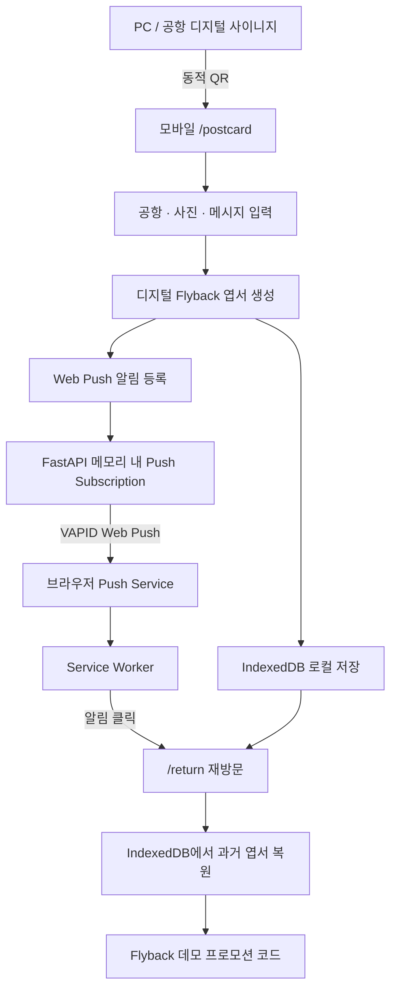

# TIME CAPSULE FLYBACK

> 여행의 순간을 저장하고, 1년 뒤 새로운 지방공항에서 다시 만나는 QR 기반 디지털 타임캡슐 여행 서비스 데모

## Overview

**TIME CAPSULE FLYBACK**은 공항에서 시작된 여행의 기억을 디지털 엽서로 만들고, 시간이 흐른 뒤 다른 지방공항에서 다시 여행을 이어가는 경험을 제안하는 웹서비스 데모입니다.

PC 또는 공항 디지털 사이니지의 QR 코드에서 모바일 경험이 시작됩니다. 사용자는 스마트폰에서 이용 공항, 여행 사진, 메시지를 선택해 디지털 엽서를 만들고 Flyback Web Push 알림을 등록할 수 있습니다.

데모에서는 실제 12개월을 기다리는 대신 시간 경과를 시뮬레이션합니다. Web Push 알림을 누르면 당시 작성했던 디지털 엽서가 다시 나타나고, 새로운 지방공항 이용을 유도하는 일회성 데모 프로모션 코드가 함께 제공됩니다.

이 프로젝트는 실제 예약·할인 시스템을 구축하기보다 **여행 추억 → 시간차 재접점 → 지방공항 재방문**으로 이어지는 사용자 여정과 핵심 기술의 동작 가능성을 검증하는 데 초점을 두었습니다.

---

## Service Flow

```text
PC / 공항 디지털 사이니지
        ↓
동적 QR 코드
        ↓
스마트폰 /postcard 접속
        ↓
공항 선택 · 여행 사진 · 메시지 작성
        ↓
디지털 Flyback 엽서 생성
        ↓
IndexedDB에 엽서 로컬 저장
        ↓
Web Push 알림 등록
        ↓
12개월 후 상황 시뮬레이션
        ↓
스마트폰 Web Push 수신
        ↓
알림 클릭
        ↓
/return 재방문
        ↓
과거 디지털 엽서 복원
        ↓
타 지방공항 전용 프로모션 코드 제공
```

---

## Demo 화면

<table>
  <tr>
    <th width="50%">메인 이벤트 화면</th>
    <th width="50%">모바일 엽서 제작</th>
  </tr>
  <tr>
    <td align="center" valign="top">
      
    </td>
    <td align="center" valign="top">
      
    </td>
  </tr>
</table>

<br>

<table>
  <tr>
    <th width="50%">Web Push 알림</th>
    <th width="50%">재방문 프로모션 화면</th>
  </tr>
  <tr>
    <td align="center" valign="top">
      
    </td>
    <td align="center" valign="top">
      
    </td>
  </tr>
</table>

---

## Key Features

- 현재 접속 Origin을 기준으로 `/postcard` URL을 담은 QR 코드 동적 생성
- 스마트폰 중심의 디지털 Flyback 엽서 제작
- 공항 선택, 여행 사진, 최대 200자 메시지를 반영한 포토 엽서 미리보기
- IndexedDB를 이용한 사진, 메시지, 공항 정보의 브라우저 로컬 저장
- Push 알림 클릭 후 `/return`에서 과거 디지털 엽서 복원
- Service Worker, Push API, VAPID 기반 실제 Web Push 구독 및 알림 수신
- iPhone 홈 화면 Web App 환경에서 Web Push 동작 확인
- Cloudflare Tunnel을 활용한 HTTPS 모바일 외부 접속
- 알림 클릭 시 공항 정보와 데모 프로모션 코드를 전달하는 재방문 화면
- 브라우저 Clipboard API를 이용한 프로모션 코드 복사
- endpoint 기준 Push Subscription 중복 등록 방지
- 만료된 Push Subscription 정리
- 실제 12개월 대기 없이 Flyback 사용자 경험을 확인할 수 있는 데모 모드

---

## Architecture



### 동작 구조

- **FastAPI**는 페이지 라우팅, Jinja2 렌더링, QR 이미지 생성, VAPID 공개키 제공, Push Subscription 등록 및 테스트 Web Push 발송을 담당합니다.
- **브라우저**에서는 여행 사진과 메시지를 이용해 디지털 엽서를 생성합니다.
- 완성된 엽서 정보는 서버가 아닌 **IndexedDB**에 로컬 저장됩니다.
- **Service Worker**는 백그라운드 Web Push 수신과 알림 클릭 처리를 담당합니다.
- 사용자가 알림을 누르면 `/return`으로 이동하고 IndexedDB에서 기존 엽서를 다시 불러옵니다.

---

## Tech Stack

| 구분 | 기술 | 역할 |
| --- | --- | --- |
| Backend | Python, FastAPI | 라우팅, QR 생성, Push API 및 서버 로직 |
| Server | Uvicorn | ASGI 애플리케이션 실행 |
| Template | Jinja2 | 메인, 엽서, 재방문 페이지 렌더링 |
| Frontend | HTML, CSS, JavaScript | 반응형 UI와 사용자 인터랙션 |
| Browser Storage | IndexedDB | 디지털 엽서 로컬 저장 및 재방문 시 복원 |
| Push | Service Worker, Push API, Web Push, VAPID | 백그라운드 알림 수신 및 재방문 연결 |
| Network | Cloudflare Tunnel | HTTPS 기반 모바일 외부 접속 |
| Development | PyCharm, OpenAI Codex, Git, GitHub | 개발 지원 및 버전 관리 |

주요 Python 패키지는 **FastAPI, Uvicorn, Jinja2, qrcode, Pillow, pywebpush, cryptography**입니다.

---

## Project Structure

```text
flyback-demo/
├─ .gitignore
├─ main.py
├─ requirements.txt
├─ README.md
│
├─ templates/
│  ├─ index.html
│  ├─ postcard.html
│  └─ return.html
│
└─ static/
   ├─ manifest.webmanifest
   ├─ sw.js
   │
   ├─ css/
   │  └─ style.css
   │
   ├─ images/
   │  ├─ kac-logo.png
   │  ├─ gimpo-airport.jpg
   │  └─ aircraft.jpg
   │
   └─ js/
      ├─ app.js
      ├─ postcard.js
      └─ return.js
```

`.venv`, IDE 설정 파일과 Python 캐시는 `.gitignore`를 통해 Git 추적 대상에서 제외합니다.

---

## Local 실행 방법

PowerShell과 Python 3.12 환경을 기준으로 합니다.

### 1. 가상환경 생성

```powershell
py -3.12 -m venv .venv
```

### 2. 가상환경 활성화

```powershell
.\.venv\Scripts\Activate.ps1
```

### 3. 패키지 설치

```powershell
python -m pip install -r requirements.txt
```

### 4. FastAPI 실행

```powershell
python -m uvicorn main:app --reload
```

### 5. 브라우저 접속

- 메인 화면: `http://127.0.0.1:8000/`
- 모바일 엽서: `http://127.0.0.1:8000/postcard`
- 재방문 화면 예시: `http://127.0.0.1:8000/return?airport=김포국제공항&code=FLYBACK-DEMO01`

VAPID 키 환경변수가 없는 개발 환경에서는 서버 프로세스에서 사용할 임시 개발용 키가 생성될 수 있습니다.

서버를 재시작하면 메모리에서 관리하던 Push Subscription과 임시 개발 키가 초기화될 수 있으므로 Web Push 테스트 시 알림을 다시 등록해야 할 수 있습니다.

---

## Cloudflare Tunnel을 통한 모바일 테스트

Service Worker와 Web Push를 실제 스마트폰에서 테스트하기 위해 HTTPS 환경을 사용합니다.

FastAPI 서버가 실행된 상태에서 별도 터미널에 다음 명령을 실행합니다.

```powershell
cloudflared tunnel --url http://localhost:8000
```

Cloudflare가 발급한 예시 주소:

```text
https://xxxxx.trycloudflare.com
```

### 테스트 순서

1. 출력된 `https://...trycloudflare.com` 주소로 PC 메인 화면에 접속합니다.
2. 메인 화면의 QR 코드를 스마트폰으로 스캔합니다.
3. iPhone에서는 Safari 페이지를 **홈 화면에 추가**합니다.
4. 홈 화면의 Flyback Web App을 실행합니다.
5. 이용 공항, 여행 사진, 메시지를 입력합니다.
6. 디지털 Flyback 엽서를 생성합니다.
7. `1년 뒤 Flyback 알림 받기`를 눌러 알림 권한을 허용합니다.
8. `1년 뒤 Flyback 미리 체험하기`를 통해 12개월 후 상황을 즉시 시뮬레이션합니다.
9. 실제 Web Push 알림 수신을 확인합니다.
10. 알림을 눌러 `/return` 화면으로 이동합니다.
11. 과거에 작성한 디지털 엽서가 다시 표시되는지 확인합니다.
12. 타 지방공항 전용 데모 프로모션 코드와 코드 복사 기능을 확인합니다.

> Service Worker와 Web Push 테스트에는 HTTPS 환경이 필요합니다.

> Cloudflare Quick Tunnel 주소가 변경되면 Origin 역시 변경됩니다. 따라서 기존 홈 화면 Web App, Push Subscription, IndexedDB 데이터는 새로운 Tunnel Origin과 공유되지 않습니다.

---

## Data Handling

현재 데모는 개인정보와 여행 콘텐츠를 **서버에 영구 저장하지 않습니다.**

- 이름, 이메일, 전화번호 및 회원정보를 입력받지 않습니다.
- 사용자가 선택한 여행 사진, 메시지, 공항 정보는 FastAPI 서버로 업로드하지 않습니다.
- 디지털 엽서 재방문 체험을 위해 사진, 메시지, 공항 정보를 해당 브라우저의 **IndexedDB**에 로컬 저장합니다.
- 저장된 엽서는 동일한 브라우저 Origin에서 `/return` 화면 진입 시 다시 불러옵니다.
- LocalStorage, SessionStorage, Cookie는 사용하지 않습니다.
- Web Push Subscription은 FastAPI 프로세스 메모리에만 임시 보관합니다.
- 서버 종료 시 메모리에 보관된 Push Subscription 정보는 사라집니다.
- 프로모션 코드는 데모 알림 발송 시 임의 생성하며 서버에 영구 저장하지 않습니다.

### IndexedDB 사용 목적

IndexedDB는 실제 장기 데이터 저장 시스템을 대신하기 위한 것이 아니라,

**“현재 만든 엽서가 1년 뒤 다시 나타난다”**

는 서비스 사용자 경험을 데모 환경에서 구현하기 위해 사용합니다.

> Cloudflare Quick Tunnel 주소가 변경되면 Origin도 변경되므로 이전 Origin의 IndexedDB 데이터에는 접근할 수 없습니다.

---

## Demo Scope

현재 구현은 서비스 콘셉트와 핵심 사용자 여정을 검증하기 위한 프로토타입입니다.

### 구현 범위

- 접속 Origin 기반 QR 코드 동적 생성
- 모바일 디지털 엽서 제작
- 사진 및 메시지 브라우저 로컬 저장
- IndexedDB 기반 과거 디지털 엽서 복원
- Service Worker 기반 Web Push
- iPhone 홈 화면 Web App 알림 수신
- 12개월 후 상황 시뮬레이션
- Push 알림 클릭을 통한 재방문
- 과거 디지털 엽서 재표시
- 타 지방공항 전용 데모 프로모션 코드 생성
- 프로모션 코드 Clipboard 복사

### 현재 제외 범위

- 실제 12개월 예약 발송
- 운영용 서버 데이터베이스
- 사용자 회원 계정
- 사진 및 메시지 서버 저장
- 실제 항공권 할인 적용
- 실제 공항 이용 여부 검증
- 항공사 예약 시스템 연계
- 외부 공항·항공사 API 연계
- 실제 지역화폐 및 면세점 혜택 지급

---

## 실제 서비스 확장 시 고려사항

실제 운영 서비스로 확대할 경우 다음 항목에 대한 추가 설계가 필요합니다.

- 사용자 동의 및 개인정보 수집·이용 정책
- 여행 콘텐츠 보유 기간 및 삭제 정책
- Push Subscription 영속화 및 사용자 철회 기능
- VAPID 개인키의 Secret Manager 보관
- 개발·검증·운영 환경별 키 관리
- 실제 12개월 예약 발송을 위한 스케줄링 시스템
- 예약 작업 실패 재시도 및 장애 복구 체계
- 만료·해지된 Push Subscription 정리
- 다중 모바일 기기 관리
- 데이터 암호화 및 접근 통제
- 개인정보 영향평가
- 감사 로그 및 운영 모니터링
- 실제 공항 이용 또는 입국 여부 검증
- 항공사, 공항, 프로모션 운영 주체와의 API 연계
- 프로모션 발급·사용·정산 정책
- 다국어 지원
- 웹 접근성
- 다양한 모바일 브라우저 및 OS 품질 검증

---

## Project Goal

본 프로젝트의 목적은 완성된 상용 서비스를 구축하는 것이 아니라,

> **여행 추억 → 시간차 재접점 → 지방공항 재방문**

이라는 서비스 아이디어를 실제 사용자 흐름으로 구현하고,

**QR, 모바일 웹, IndexedDB, Web Push, Service Worker를 연결한 End-to-End 프로토타입을 통해 기술적 구현 가능성을 검증하는 것**입니다.

---

## Disclaimer

본 프로젝트는 서비스 기획 및 기능 검증을 위한 **Demo Prototype**입니다.

프로젝트에서 생성되는 Flyback 프로모션 코드는 서비스 시연을 위해 임의 생성되는 데모 코드이며, 실제 공항, 항공사, 면세점 또는 기타 상업시설에서 사용할 수 있는 할인코드가 아닙니다.
